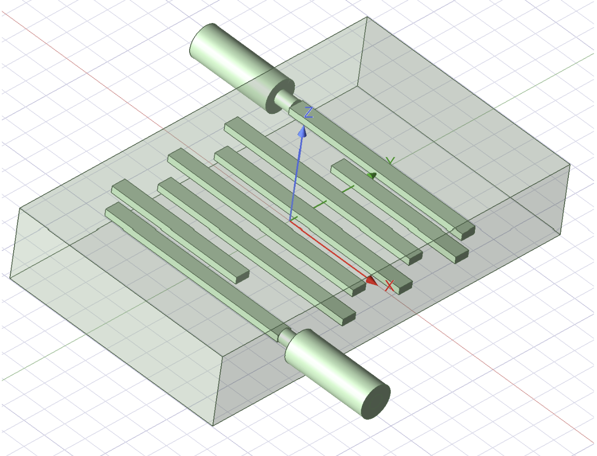
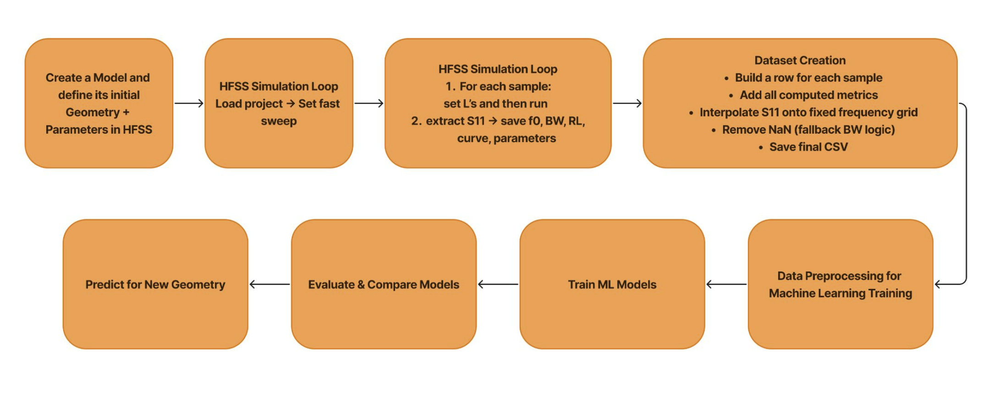

# HFSS-Based Bandpass Filter Design with Machine Learning Surrogate Modeling

> Automated EM simulation and ML-driven surrogate modeling for accelerated microwave bandpass filter design.

---

## 📌 Project Context

This repository contains **my individual contribution (HFSS part)** to the group project:

**"Comparative Bandpass Filter Design in HFSS and CST with Machine Learning"**

This repo focuses exclusively on:

- HFSS electromagnetic modeling
- Automated dataset generation using PyAEDT
- Machine learning regression models
- Surrogate-assisted microwave filter design

The CST workflow and comparative analysis are part of the full group submission.

---

# 🏗 Overview

Microwave bandpass filter design requires repeated full-wave EM simulations, which are computationally expensive and time-consuming.

This project integrates:

- **Ansys HFSS**
- **Python Automation (PyAEDT)**
- **Machine Learning Regression Models**

to build a **surrogate model** capable of predicting filter performance without repeatedly running full-wave simulations.

---

# 🧠 Technical Workflow

## 1️⃣ HFSS Filter Design

- Parallel-coupled microstrip resonator topology
- PEC resonator strips
- Two-port excitation
- Frequency sweep: **0.6 – 2.4 GHz**
- 451 frequency points

### Parameterized Variables

The following geometric parameters are varied: L1, L2, L3, L4

These directly influence the filter’s center frequency and coupling behavior.

---

## 2️⃣ Automated Dataset Generation (PyAEDT)

HFSS was controlled programmatically using:

- PyAnsys ecosystem
- PyAEDT API
- Non-graphical execution mode for faster runs

### Sampling Strategy

**Latin Hypercube Sampling (LHS)**  
Efficient coverage of the 4D design space.

For each sampled geometry:

1. Update L1–L4 in HFSS  
2. Run simulation  
3. Extract S11 and S21  
4. Compute bandpass metrics:
   - Center frequency (f₀)
   - 3 dB bandwidth
   - Insertion Loss (IL)
   - Return Loss (RL)
5. Store results in CSV

### Dataset Sizes

- 10 samples
- 150 samples
- 500 samples
- 1000 samples
- Combined (1000 + 500)

---

# 🤖 Machine Learning Pipeline

# Regression Model Evaluation

The following regression models were evaluated for predicting filter performance:

## Linear Models

- Linear Regression
- Ridge Regression
- Lasso Regression
- ElasticNet Regression
- Bayesian Ridge Regression
- Huber Regressor
- Polynomial Regression (Degree = 3)

## Distance-Based Models

- k-Nearest Neighbors (k = 7)

## Tree-Based Models

- Decision Tree Regressor
- Random Forest Regressor
- Extra Trees Regressor
- Gradient Boosting Regressor
- AdaBoost Regressor

## Kernel-Based Models

- Support Vector Regression (RBF Kernel)
- Gaussian Process Regressor (Constant × RBF Kernel)

## Neural Network

- Multi-Layer Perceptron (MLP) Regressor

---

## ⚙ Feature Scaling

For models sensitive to feature magnitude:

- Standardization applied using `StandardScaler`
- Integrated within a Scikit-learn `Pipeline` for clean preprocessing

---

## 📊 Evaluation Metrics

Models were evaluated on the held-out test set using:

- $R^2$ Score
- Mean Absolute Error (MAE)
- Mean Squared Error (MSE)
- Root Mean Squared Error (RMSE)

Model comparison included:

- Metric comparison tables
- $R^2$ bar plots

---

## 🔎 Diagnostic Analysis

The best-performing model (based on test $R^2$) was further analyzed using:

- True vs Predicted scatter plots
- Sorted true vs predicted curves
- Residual histograms
- Residual vs predicted value plots
- Absolute error boxplots (Top 5 models)

For tree-based models:

- Feature importance scores were extracted
- Relative contribution of $L_1, L_2, L_3, L_4$ to predicted $f_0$ was analyzed

# Key Findings

📄 For detailed results, see the [Full Results Report](./Report/Project%20Report.pdf).

## HFSS-Based Surrogate Models

- **Dataset size is critical.** With only 10 samples, all models yielded negative test $R^2$. Performance improved steadily from 150 → 500 → 1000 samples, with positive $R^2$ achieved only at larger sizes.
- **Tree-ensemble methods dominate.** Random Forest achieved the best single-dataset performance (1000 samples, $R^2 = 0.5237$); Extra Trees led on the joint 500+1000 dataset ($R^2 = 0.5602$), both with the lowest RMSE in their respective cases.
- **Joint dataset helps, but unevenly.** Combining the 500 and 1000-sample sets boosted most models, particularly ensemble learners, though gains were not uniform across all model classes.
- **Feature importance highlights key geometric drivers.** Random Forest analysis (1000 samples) identifies $L_3$ and $L_4$ as the most influential inputs for predicting $f_0$, with $L_1$ and $L_2$ having comparatively smaller impact.

> HFSS models appear data-limited — best test $R^2$ reaches only ~0.50–0.56, suggesting more samples and broader design-space coverage are needed for stronger generalization.

---
