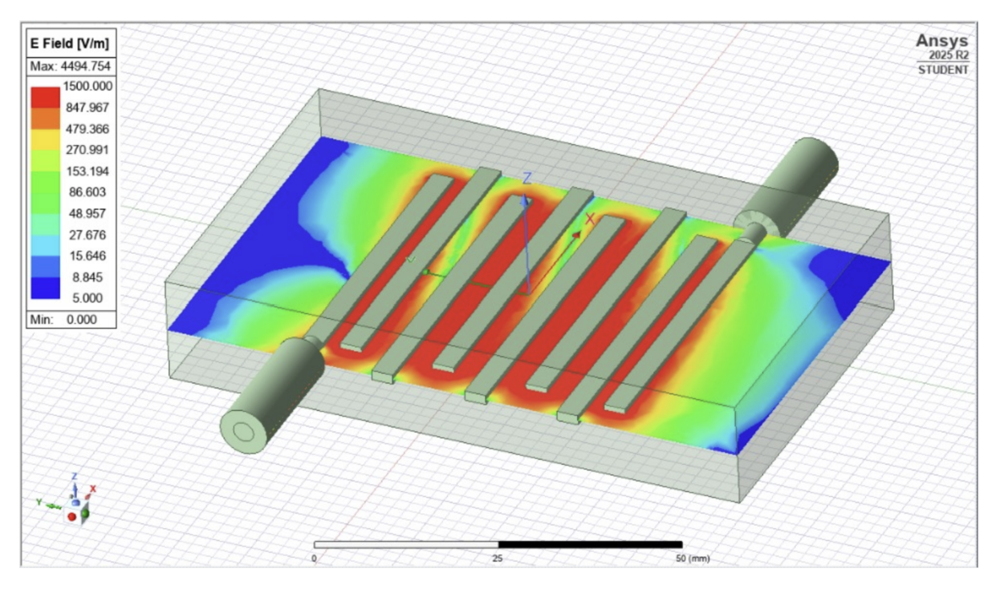

# 🚀 HFSS-Based Bandpass Filter Design with Machine Learning Surrogate Modeling

> Automated EM simulation and ML-driven surrogate modeling for accelerated microwave bandpass filter design.

---

## 📌 Project Context

This repository contains **my individual contribution (HFSS part)** to the group project:

**"Comparative Bandpass Filter Design in HFSS and CST with Machine Learning"**

This repo focuses exclusively on:

- HFSS electromagnetic modeling
- Automated dataset generation using PyAEDT
- Machine learning regression models
- Surrogate-assisted microwave filter design

The CST workflow and comparative analysis are part of the full group submission.

---

# 🏗 Overview

Microwave bandpass filter design requires repeated full-wave EM simulations, which are computationally expensive and time-consuming.

This project integrates:

- **Ansys HFSS**
- **Python Automation (PyAEDT)**
- **Machine Learning Regression Models**

to build a **surrogate model** capable of predicting filter performance without repeatedly running full-wave simulations.

---

# 🧠 Technical Workflow

## 1️⃣ HFSS Filter Design

- Parallel-coupled microstrip resonator topology
- PEC resonator strips
- Two-port excitation
- Frequency sweep: **0.6 – 2.4 GHz**
- 451 frequency points

### Parameterized Variables

The following geometric parameters are varied:

- L1
- L2
- L3
- L4

These directly influence the filter’s center frequency and coupling behavior.

---

## 2️⃣ Automated Dataset Generation (PyAEDT)

HFSS was controlled programmatically using:

- PyAnsys ecosystem
- PyAEDT API
- Non-graphical execution mode for faster runs

### Sampling Strategy

**Latin Hypercube Sampling (LHS)**  
Efficient coverage of the 4D design space.

For each sampled geometry:

1. Update L1–L4 in HFSS  
2. Run simulation  
3. Extract S11 and S21  
4. Compute bandpass metrics:
   - Center frequency (f₀)
   - 3 dB bandwidth
   - Insertion Loss (IL)
   - Return Loss (RL)
5. Store results in CSV

### Dataset Sizes

- 10 samples
- 150 samples
- 500 samples
- 1000 samples
- Combined (1000 + 500)

---

# 🤖 Machine Learning Pipeline

## Problem Formulation

**Regression Task**

Input: